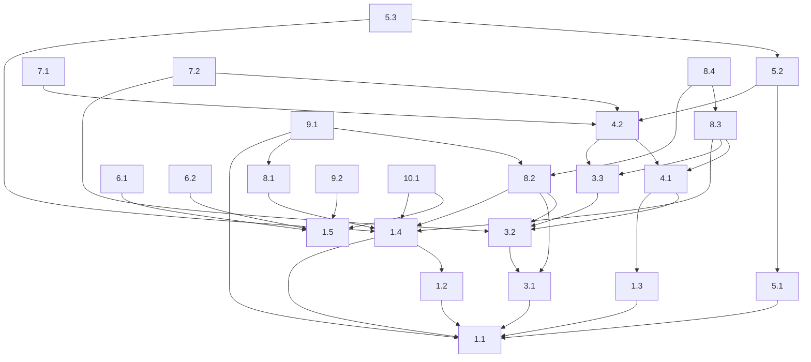

# Epic 10 -- Task 10.2: Create a Release Notes Template

**Type:** `docs`

**Background:** When creating releases, consistent release notes help users and developers understand what has changed. A template standardizes this process.

**Acceptance Criteria:**
*   A Markdown file (e.g., `RELEASE_NOTES_TEMPLATE.md`) is created in the repository (perhaps in a `/docs` or `/ci` folder).
*   The template includes sections for:
    *   Release Version (placeholder)
    *   Date (placeholder)
    *   New Features
    *   Bug Fixes
    *   Known Issues
    *   Changes (e.g., a link to the commit log or important PRs)
*   The template is simple and easy to fill out.

**Dependencies:** None

**Parallelizable?:** `yes`

**Suggested Labels:** `documentation`, `release`, `developer-ux`

**Effort Estimate:** S

**Definition of Done:** A `RELEASE_NOTES_TEMPLATE.md` file is committed to the repository.

### Suggested Execution Timeline

*   **Phase 1:**
    *   Task 1.1 (Parallelizable) (Depends on )
    *   Task 1.5 (Parallelizable) (Depends on )
    *   Task 2.1 (Parallelizable) (Depends on )
    *   Task 9.3 (Parallelizable) (Depends on )
    *   Task 10.2 (Parallelizable) (Depends on )

*   **Phase 2:** (Tasks dependent on previous phase completions)
    *   Task 1.2 (Parallelizable) (Depends on 1.1)
    *   Task 1.3 (Depends on 1.1)
    *   Task 3.1 (Parallelizable) (Depends on 1.1)
    *   Task 5.1 (Parallelizable) (Depends on 1.1)
    *   Task 6.1 (Parallelizable) (Depends on 1.5)
    *   Task 6.2 (Parallelizable) (Depends on 1.5)
    *   Task 9.2 (Parallelizable) (Depends on 1.5)

*   **Phase 3:** (Tasks dependent on previous phase completions)
    *   Task 1.4 (Parallelizable) (Depends on 1.1, 1.2)
    *   Task 3.2 (Depends on 3.1)

*   **Phase 4:** (Tasks dependent on previous phase completions)
    *   Task 3.3 (Depends on 3.2)
    *   Task 4.1 (Depends on 1.3, 3.2)
    *   Task 8.1 (Parallelizable) (Depends on 1.4)
    *   Task 8.2 (Parallelizable) (Depends on 3.1, 3.2, 1.4)
    *   Task 10.1 (Parallelizable) (Depends on 1.4, 1.5)

*   **Phase 5:** (Tasks dependent on previous phase completions)
    *   Task 4.2 (Depends on 4.1, 3.3)
    *   Task 9.1 (Parallelizable) (Depends on 1.1, 8.1, 8.2)

*   **Phase 6:** (Tasks dependent on previous phase completions)
    *   Task 5.2 (Depends on 5.1, 4.2)
    *   Task 7.1 (Depends on 4.2)
    *   Task 7.2 (Depends on 3.2, 4.2)
    *   Task 8.3 (Depends on 3.3, 4.1, 1.4)

*   **Phase 7:** (Tasks dependent on previous phase completions)
    *   Task 5.3 (Parallelizable) (Depends on 5.2, 1.4)
    *   Task 8.4 (Parallelizable) (Depends on 8.2, 8.3)
