# LuxoAI Architecture

## Component Diagram (PlantUML)

```plantuml
@startuml
skinparam componentStyle uml2
skinparam linetype ortho

package "Python Agent (Mobile-Agent-E)" <<Frame>> {
  component "InfoPool" as PyInfoPool
  component "BaseAgent" as PyBaseAgent
  component "Manager" as PyManager
  component "Operator" as PyOperator
  component "ActionReflector" as PyActionReflector
  component "Notetaker" as PyNotetaker
  component "ExperienceReflectorShortCut" as PyExperienceReflectorShortCut
  component "ExperienceReflectorTips" as PyExperienceReflectorTips
  component "ExperienceRetrieverShortCut" as PyExperienceRetrieverShortCut
  component "ExperienceRetrieverTips" as PyExperienceRetrieverTips
  component "remove_boxes()" as PyFuncremove_boxes
  component "det()" as PyFuncdet
  component "get_screenshot()" as PyFuncget_screenshot
  component "start_recording()" as PyFuncstart_recording
  component "end_recording()" as PyFuncend_recording
  component "save_screenshot_to_file()" as PyFuncsave_screenshot_to_file
  component "tap()" as PyFunctap
  component "type()" as PyFunctype
  component "enter()" as PyFuncenter
  component "swipe()" as PyFuncswipe
  component "back()" as PyFuncback
  component "home()" as PyFunchome
  component "switch_app()" as PyFuncswitch_app
  component "crop_image()" as PyFunccrop_image
  component "calculate_size()" as PyFunccalculate_size
  component "calculate_iou()" as PyFunccalculate_iou
  component "crop()" as PyFunccrop
  component "in_box()" as PyFuncin_box
  component "init_action_chat()" as PyFuncinit_action_chat
  component "init_reflect_chat()" as PyFuncinit_reflect_chat
  component "init_memory_chat()" as PyFuncinit_memory_chat
  component "add_response()" as PyFuncadd_response
  component "add_response_two_image()" as PyFuncadd_response_two_image
  component "print_status()" as PyFuncprint_status
  component "extract_json_object()" as PyFuncextract_json_object
  component "encode_image()" as PyFuncencode_image
  component "track_usage()" as PyFunctrack_usage
  component "inference_chat()" as PyFuncinference_chat
  component "order_point()" as PyFuncorder_point
  component "longest_common_substring_length()" as PyFunclongest_common_substring_length
  component "ocr()" as PyFuncocr
}

package "Android Application (LuxoAI)" <<Frame>> {
  component "MainActivity" as AndroidMainActivity
}

  PyFuncremove_boxes ..> Pylen : calls
  PyFuncencode_image ..> Pyopen : calls
  PyFunclongest_common_substring_length ..> Pylen : calls
  PyOperator.execute_atomic_action ..> PyFuncswitch_app : calls
  PyOperator.execute_atomic_action ..> PyFunctype : calls
  PyFunccrop_image ..> Pydistance : calls
  PyFuncend_recording ..> Pyprint : calls
  Pycontroller ..> Pyos : imports
  PyOperator.get_prompt ..> Pylen : calls
  Pyagents ..> Pytime : imports
  Pycontroller ..> PyImage : imports
  PyFuncinference_chat ..> PyFunctrack_usage : calls
  PyFuncocr ..> Pyrange : calls
  PyFuncdet ..> Pygroundingdino_model : calls
  PyFunccalculate_iou ..> Pymin : calls
  PyBaseAgent --|> PyExperienceReflectorTips : inherits
  PyFuncprint_status ..> Pylen : calls
  Pyagents ..> Pyabstractmethod : imports
  Pytext_localization ..> Pycv2 : imports
  PyBaseAgent --|> PyNotetaker : inherits
  PyFuncadd_response_two_image ..> PyFuncencode_image : calls
  PyFunccrop ..> Pycv2 : imports
  PyFuncend_recording ..> Pysleep : calls
  PyFunccrop ..> Pymath : imports
  PyFuncinference_chat ..> PyValueError : calls
  PyOperator.execute ..> Pyprint : calls
  PyFunccrop ..> Pynumpy : imports
  PyManager.get_prompt ..> Pyzip : calls
  Pyapi ..> Pyjson : imports
  Pytext_localization ..> Pynumpy : imports
  PyOperator.execute_atomic_action ..> Pyint : calls
  PyExperienceReflectorShortCut.add_new_shortcut ..> Pyprint : calls
  PyBaseAgent --|> PyExperienceRetrieverShortCut : inherits
  PyOperator.get_prompt ..> Pymin : calls
  PyOperator.execute_atomic_action ..> PyFuncenter : calls
  PyOperator.execute_atomic_action ..> PyFuncback : calls
  PyFuncremove_boxes ..> Pyrange : calls
  PyFuncremove_boxes ..> Pyenumerate : calls
  PyABC --|> PyBaseAgent : inherits
  PyFunclongest_common_substring_length ..> Pyrange : calls
  PyFuncocr ..> PyFunccrop_image : calls
  Pyicon_localization ..> PyImage : imports
  PyFuncremove_boxes ..> PyFunccalculate_iou : calls
  Pyagents ..> Pyfield : imports
  PyOperator.execute_atomic_action ..> PyFuncswipe : calls
  PyBaseAgent --|> PyExperienceRetrieverTips : inherits
  PyFuncdet ..> PyFuncremove_boxes : calls
  PyFuncocr ..> Pyocr_recognition : calls
  PyOperator.execute_atomic_action ..> Pylen : calls
  PyExperienceReflectorTips.get_prompt ..> Pylen : calls
  PyFunclongest_common_substring_length ..> Pymax : calls
  PyFuncsave_screenshot_to_file ..> Pyprint : calls
  PyOperator.execute_atomic_action ..> PyFuncocr : calls
  PyFunccrop ..> PyImageDraw : imports
  Pyagents ..> Pyjson : imports
  PyFuncinference_chat ..> Pyopen : calls
  PyBaseAgent --|> PyManager : inherits
  Pyagents ..> PyABC : imports
  Pyagents ..> Pyos : imports
  Pyagents ..> Pycopy : imports
  PyOperator.execute_atomic_action ..> Pyrange : calls
  Pycontroller ..> Pytime : imports
  Pycontroller ..> Pysubprocess : imports
  PyFunccalculate_iou ..> Pymax : calls
  PyFuncadd_response ..> PyFuncencode_image : calls
  PyFuncprint_status ..> Pyprint : calls
  PyOperator.execute ..> Pyenumerate : calls
  PyFuncocr ..> Pyint : calls
  Pyagents ..> Pyre : imports
  PyFuncocr ..> Pylist : calls
  Pydistance ..> Pypow : calls
  Pycontroller ..> Pysleep : imports
  PyFuncinference_chat ..> Pylen : calls
  Pyagents ..> Pydataclass : imports
  PyBaseAgent --|> PyExperienceReflectorShortCut : inherits
  PyExperienceRetrieverShortCut.parse_response ..> PyFuncextract_json_object : calls
  PyOperator.execute ..> PyFuncsave_screenshot_to_file : calls
  PyFuncstart_recording ..> Pyprint : calls
  PyFuncocr ..> Pyocr_detection : calls
  PyOperator.execute_atomic_action ..> PyFunctap : calls
  PyOperator.execute ..> PyFuncextract_json_object : calls
  PyExperienceReflectorShortCut.get_prompt ..> Pylen : calls
  PyFuncinference_chat ..> Pyprint : calls
  PyFuncdet ..> Pyrange : calls
  PyFuncocr ..> PyFuncorder_point : calls
  PyExperienceReflectorShortCut.add_new_shortcut ..> PyFuncextract_json_object : calls
  PyFuncsave_screenshot_to_file ..> Pystr : calls
  Pyapi ..> Pysleep : imports
  PyFunccrop_image ..> Pyrange : calls
  PyInfoPool ..> Pyfield : calls
  PyManager.get_prompt ..> Pyenumerate : calls
  PyFuncremove_boxes ..> Pyset : calls
  PyFunccrop_image ..> Pyint : calls
  PyOperator.get_prompt ..> Pyzip : calls
  Pyapi ..> Pybase64 : imports
  PyBaseAgent --|> PyActionReflector : inherits
  PyExperienceReflectorTips.get_prompt ..> Pyzip : calls
  PyBaseAgent --|> PyOperator : inherits
  PyFunccrop ..> PyImage : imports
  PyFuncinference_chat ..> Pysleep : calls
  Pychat ..> Pycopy : imports
  PyOperator.execute_atomic_action ..> PyFunchome : calls
  PyFuncremove_boxes ..> PyFunccalculate_size : calls
  PyOperator.execute ..> Pylen : calls
  PyFuncsave_screenshot_to_file ..> PyRuntimeError : calls
  Pyicon_localization ..> Pytorch : imports
  Pyapi ..> Pyrequests : imports
  PyExperienceReflectorShortCut.get_prompt ..> Pyzip : calls
  AndroidComponentActivity --|> AndroidMainActivity : inherits
  PyOperator ..> AndroidMainActivity : (conceptual) interacts with via ADB commands
package "Integration" <<Cloud>> {
 component "Chaquopy" as ChaquopyIntegration
}
PyOperator ..> ChaquopyIntegration : (conceptual) Python execution via
ChaquopyIntegration ..> AndroidMainActivity : (conceptual) embedded in

@enduml
```

## Architecture Overview

This document provides a high-level overview of the LuxoAI project architecture, generated by analyzing the codebase. It includes the Python agent and the Android application components.

### Python Agent (Mobile-Agent-E)
Key components found in `Mobile-Agent-E/MobileAgentE/`:
#### Classes:
- **`InfoPool`**: (Module: `agents`)
- **`BaseAgent`**: (Module: `agents`), Inherits: `ABC`
- **`Manager`**: (Module: `agents`), Inherits: `BaseAgent`
- **`Operator`**: (Module: `agents`), Inherits: `BaseAgent`
- **`ActionReflector`**: (Module: `agents`), Inherits: `BaseAgent`
- **`Notetaker`**: (Module: `agents`), Inherits: `BaseAgent`
- **`ExperienceReflectorShortCut`**: (Module: `agents`), Inherits: `BaseAgent`
- **`ExperienceReflectorTips`**: (Module: `agents`), Inherits: `BaseAgent`
- **`ExperienceRetrieverShortCut`**: (Module: `agents`), Inherits: `BaseAgent`
- **`ExperienceRetrieverTips`**: (Module: `agents`), Inherits: `BaseAgent`

#### Standalone Functions:
- **`remove_boxes()`**: (Module: `icon_localization`)
- **`det()`**: (Module: `icon_localization`)
- **`get_screenshot()`**: (Module: `controller`)
- **`start_recording()`**: (Module: `controller`)
- **`end_recording()`**: (Module: `controller`)
- **`save_screenshot_to_file()`**: (Module: `controller`)
- **`tap()`**: (Module: `controller`)
- **`type()`**: (Module: `controller`)
- **`enter()`**: (Module: `controller`)
- **`swipe()`**: (Module: `controller`)
- **`back()`**: (Module: `controller`)
- **`home()`**: (Module: `controller`)
- **`switch_app()`**: (Module: `controller`)
- **`crop_image()`**: (Module: `crop`)
- **`calculate_size()`**: (Module: `crop`)
- **`calculate_iou()`**: (Module: `crop`)
- **`crop()`**: (Module: `crop`)
- **`in_box()`**: (Module: `crop`)
- **`init_action_chat()`**: (Module: `chat`)
- **`init_reflect_chat()`**: (Module: `chat`)
- **`init_memory_chat()`**: (Module: `chat`)
- **`add_response()`**: (Module: `agents`)
- **`add_response_two_image()`**: (Module: `agents`)
- **`print_status()`**: (Module: `agents`)
- **`extract_json_object()`**: (Module: `agents`)
- **`encode_image()`**: (Module: `api`)
- **`track_usage()`**: (Module: `api`)
- **`inference_chat()`**: (Module: `api`)
- **`order_point()`**: (Module: `text_localization`)
- **`longest_common_substring_length()`**: (Module: `text_localization`)
- **`ocr()`**: (Module: `text_localization`)

### Android Application (LuxoAI)
Key components found in `LuxoAI/app/src/main/`:
#### Classes:
- **`MainActivity`**: (Module: `MainActivity`), Inherits/Implements: `ComponentActivity`

### Identified Relationships & Interactions
The following is a simplified list of observed or inferred interactions:

**Python Agent Internal:**
- `ABC` inherits `BaseAgent`
- `ActionReflector.init_chat` calls attr `append`
- `ActionReflector.parse_response` calls attr `replace`
- `ActionReflector.parse_response` calls attr `split`
- `ActionReflector.parse_response` calls attr `strip`
- `BaseAgent` inherits `ActionReflector`
- `BaseAgent` inherits `ExperienceReflectorShortCut`
- `BaseAgent` inherits `ExperienceReflectorTips`
- `BaseAgent` inherits `ExperienceRetrieverShortCut`
- `BaseAgent` inherits `ExperienceRetrieverTips`
- `BaseAgent` inherits `Manager`
- `BaseAgent` inherits `Notetaker`
- `BaseAgent` inherits `Operator`
- `ExperienceReflectorShortCut.add_new_shortcut` calls `extract_json_object`
- `ExperienceReflectorShortCut.add_new_shortcut` calls `print`
- `ExperienceReflectorShortCut.get_prompt` calls attr `items`
- `ExperienceReflectorShortCut.get_prompt` calls attr `join`
- `ExperienceReflectorShortCut.get_prompt` calls `len`
- `ExperienceReflectorShortCut.get_prompt` calls `zip`
- `ExperienceReflectorShortCut.init_chat` calls attr `append`
- `ExperienceReflectorShortCut.parse_response` calls attr `replace`
- `ExperienceReflectorShortCut.parse_response` calls attr `split`
- `ExperienceReflectorShortCut.parse_response` calls attr `strip`
- `ExperienceReflectorTips.get_prompt` calls `len`
- `ExperienceReflectorTips.get_prompt` calls `zip`
- `ExperienceReflectorTips.init_chat` calls attr `append`
- `ExperienceReflectorTips.parse_response` calls attr `replace`
- `ExperienceReflectorTips.parse_response` calls attr `split`
- `ExperienceReflectorTips.parse_response` calls attr `strip`
- `ExperienceRetrieverShortCut.get_prompt` calls attr `items`
- `ExperienceRetrieverShortCut.init_chat` calls attr `append`
- `ExperienceRetrieverShortCut.parse_response` calls `extract_json_object`
- `ExperienceRetrieverShortCut.parse_response` calls attr `replace`
- `ExperienceRetrieverShortCut.parse_response` calls attr `split`
- `ExperienceRetrieverShortCut.parse_response` calls attr `strip`
- `ExperienceRetrieverTips.init_chat` calls attr `append`
- `ExperienceRetrieverTips.parse_response` calls attr `replace`
- `ExperienceRetrieverTips.parse_response` calls attr `split`
- `ExperienceRetrieverTips.parse_response` calls attr `strip`
- `InfoPool` calls `field`
- `Manager.get_prompt` calls `enumerate`
- `Manager.get_prompt` calls attr `items`
- `Manager.get_prompt` calls `zip`
- `Manager.init_chat` calls attr `append`
- `Manager.parse_response` calls attr `replace`
- `Manager.parse_response` calls attr `split`
- `Manager.parse_response` calls attr `strip`
- `Notetaker.init_chat` calls attr `append`
- `Notetaker.parse_response` calls attr `replace`
- `Notetaker.parse_response` calls attr `split`
- `Notetaker.parse_response` calls attr `strip`
- `Operator.execute` calls `enumerate`
- `Operator.execute` calls attr `execute_atomic_action`
- `Operator.execute` calls `extract_json_object`
- `Operator.execute` calls attr `items`
- `Operator.execute` calls attr `join`
- `Operator.execute` calls `len`
- `Operator.execute` calls attr `lower`
- `Operator.execute` calls `print`
- `Operator.execute` calls attr `replace`
- `Operator.execute` calls `save_screenshot_to_file`
- `Operator.execute` calls attr `sleep`
- `Operator.execute` calls attr `strip`
- `Operator.execute_atomic_action` calls `back`
- `Operator.execute_atomic_action` calls `enter`
- `Operator.execute_atomic_action` calls `home`
- `Operator.execute_atomic_action` calls `int`
- `Operator.execute_atomic_action` calls `len`
- `Operator.execute_atomic_action` calls attr `lower`
- `Operator.execute_atomic_action` calls `ocr`
- `Operator.execute_atomic_action` calls `range`
- `Operator.execute_atomic_action` calls attr `sleep`
- `Operator.execute_atomic_action` calls attr `strip`
- `Operator.execute_atomic_action` calls `swipe`
- `Operator.execute_atomic_action` calls `switch_app`
- `Operator.execute_atomic_action` calls `tap`
- `Operator.execute_atomic_action` calls `type`
- `Operator.get_prompt` calls attr `append`
- `Operator.get_prompt` calls attr `items`
- `Operator.get_prompt` calls attr `join`
- `Operator.get_prompt` calls `len`
- `Operator.get_prompt` calls `min`
- `Operator.get_prompt` calls `zip`
- `Operator.init_chat` calls attr `append`
- `Operator.parse_response` calls attr `replace`
- `Operator.parse_response` calls attr `split`
- `Operator.parse_response` calls attr `strip`
- `add_response` calls attr `append`
- `add_response` calls attr `deepcopy`
- `add_response` calls `encode_image`
- `add_response_two_image` calls attr `append`
- `add_response_two_image` calls attr `deepcopy`
- `add_response_two_image` calls `encode_image`
- `agents` imports `ABC`
- `agents` imports `abstractmethod`
- `agents` imports `back`
- `agents` imports `copy`
- `agents` imports `dataclass`
- `agents` imports `encode_image`
- `agents` imports `enter`
- `agents` imports `field`
- `agents` imports `home`
- `agents` imports `json`
- `agents` imports `ocr`
- `agents` imports `os`
- `agents` imports `re`
- `agents` imports `save_screenshot_to_file`
- `agents` imports `swipe`
- `agents` imports `switch_app`
- `agents` imports `tap`
- `agents` imports `time`
- `agents` imports `type`
- `api` imports `base64`
- `api` imports `json`
- `api` imports `requests`
- `api` imports `sleep`
- `back` calls attr `run`
- `calculate_iou` calls `max`
- `calculate_iou` calls `min`
- `chat` imports `copy`
- `chat` imports `encode_image`
- `controller` imports `Image`
- `controller` imports `os`
- `controller` imports `sleep`
- `controller` imports `subprocess`
- `controller` imports `time`
- `crop` calls attr `Draw`
- `crop` imports `Image`
- `crop` imports `ImageDraw`
- `crop` calls attr `crop`
- `crop` imports `cv2`
- `crop` imports `math`
- `crop` imports `numpy`
- `crop` calls attr `open`
- `crop` calls attr `rectangle`
- `crop` calls attr `save`
- `crop_image` calls `distance`
- `crop_image` calls attr `getPerspectiveTransform`
- `crop_image` calls `int`
- `crop_image` calls `range`
- `crop_image` calls attr `tolist`
- `crop_image` calls attr `warpPerspective`
- `crop_image` calls attr `zeros`
- `det` calls attr `Tensor`
- `det` calls attr `append`
- `det` calls attr `cpu`
- `det` calls attr `endswith`
- `det` calls `groundingdino_model`
- `det` calls attr `int`
- `det` calls attr `lower`
- `det` calls attr `open`
- `det` calls `range`
- `det` calls `remove_boxes`
- `det` calls attr `size`
- `det` calls attr `strip`
- `det` calls attr `tolist`
- `distance` calls `pow`
- `distance` calls attr `sqrt`
- `encode_image` calls attr `b64encode`
- `encode_image` calls attr `decode`
- `encode_image` calls `open`
- `encode_image` calls attr `read`
- `end_recording` calls `print`
- `end_recording` calls attr `run`
- `end_recording` calls `sleep`
- `enter` calls attr `run`
- `extract_json_object` calls attr `findall`
- `extract_json_object` calls attr `group`
- `extract_json_object` calls attr `loads`
- `extract_json_object` calls attr `search`
- `extract_json_object` calls attr `sub`
- `get_screenshot` calls attr `convert`
- `get_screenshot` calls attr `open`
- `get_screenshot` calls attr `remove`
- `get_screenshot` calls attr `run`
- `get_screenshot` calls attr `save`
- `get_screenshot` calls attr `sleep`
- `home` calls attr `run`
- `icon_localization` imports `Image`
- `icon_localization` imports `calculate_iou`
- `icon_localization` imports `calculate_size`
- `icon_localization` imports `torch`
- `inference_chat` calls `ValueError`
- `inference_chat` calls attr `append`
- `inference_chat` calls attr `dumps`
- `inference_chat` calls attr `json`
- `inference_chat` calls `len`
- `inference_chat` calls `open`
- `inference_chat` calls attr `post`
- `inference_chat` calls `print`
- `inference_chat` calls attr `replace`
- `inference_chat` calls `sleep`
- `inference_chat` calls `track_usage`
- `inference_chat` calls attr `write`
- `init_action_chat` calls attr `append`
- `init_memory_chat` calls attr `append`
- `init_reflect_chat` calls attr `append`
- `longest_common_substring_length` calls `len`
- `longest_common_substring_length` calls `max`
- `longest_common_substring_length` calls `range`
- `ocr` calls attr `append`
- `ocr` calls `crop_image`
- `ocr` calls attr `imread`
- `ocr` calls `int`
- `ocr` calls `list`
- `ocr` calls `ocr_detection`
- `ocr` calls `ocr_recognition`
- `ocr` calls `order_point`
- `ocr` calls `range`
- `ocr` calls attr `reshape`
- `order_point` calls attr `arctan2`
- `order_point` calls attr `argsort`
- `order_point` calls attr `array`
- `order_point` calls attr `astype`
- `order_point` calls attr `concatenate`
- `order_point` calls attr `reshape`
- `order_point` calls attr `sum`
- `print_status` calls `len`
- `print_status` calls `print`
- `remove_boxes` calls attr `add`
- `remove_boxes` calls `calculate_iou`
- `remove_boxes` calls `calculate_size`
- `remove_boxes` calls `enumerate`
- `remove_boxes` calls `len`
- `remove_boxes` calls `range`
- `remove_boxes` calls `set`
- `save_screenshot_to_file` calls `RuntimeError`
- `save_screenshot_to_file` calls attr `dirname`
- `save_screenshot_to_file` calls attr `makedirs`
- `save_screenshot_to_file` calls `print`
- `save_screenshot_to_file` calls attr `run`
- `save_screenshot_to_file` calls attr `sleep`
- `save_screenshot_to_file` calls `str`
- `start_recording` calls attr `Popen`
- `start_recording` calls `print`
- `start_recording` calls attr `run`
- `swipe` calls attr `run`
- `switch_app` calls attr `run`
- `tap` calls attr `run`
- `text_localization` imports `crop_image`
- `text_localization` imports `cv2`
- `text_localization` imports `numpy`
- `type` calls attr `isdigit`
- `type` calls attr `replace`
- `type` calls attr `run`

**Android App Internal:**
- `ComponentActivity` inherits `MainActivity`

**Cross-System (Conceptual):**
- The Python agent (specifically components like `Operator`) is intended to interact with the Android application by sending ADB commands (e.g., tap, swipe, type).
- Chaquopy is the planned mechanism for embedding and running Python code within the LuxoAI Android app.

*Note: This is an automated analysis. Some relationships might be simplified or inferred.*
