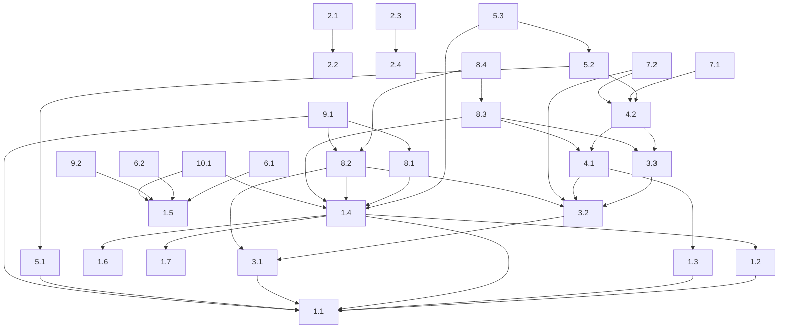

# Introduction and Guide

This document (`LuxoAI/planning/PLANNING_TASKS.md`) serves as the central backlog for all development tasks related to the LuxoAI project. It is organized into Epics, which are large bodies of work, and individual tasks within those Epics.

## Task Structure

Each task follows a standardized format:

*   **Epic Heading:** Tasks are grouped under level 2 headings, e.g., `## Epic 1 -- Environment & CI Foundation`.
*   **Task Heading:** Each task starts with a level 1 heading (relative to the Epic, effectively H3 globally if Epics are H2) indicating its Epic and Task number, followed by a descriptive title, e.g., `# Epic X -- Task X.Y: Title`.
*   **Standard Fields:** Below the task heading, each task is defined by a list of standard fields. Each field starts with its label in bold (e.g., `**Type:**`).
    *   For single-line content fields such as `**Type:**`, `**Parallelizable?:**`, `**Effort Estimate:**`, and often `**Dependencies:**`, the content follows directly on the *same line* as the label. For example:
        `**Type:** chore`
        `**Dependencies:** Task 1.1`
    *   For fields that typically contain multi-line content, such as `**Background:**`, `**Acceptance Criteria:**`, and `**Definition of Done:**`, the content starts on the *next line* after the label, indented with a new bullet or paragraph.
    *   `**Acceptance Criteria:**` is typically a bulleted list, with each item starting with `* ` (an asterisk followed by a space) and indented under the label. For example:
        ```
        *   **Acceptance Criteria:**
            *   Criterion 1 explained here.
            *   Criterion 2 explained here.
        ```
    *   The full list of standard fields is: `**Type:**`, `**Background:**`, `**Acceptance Criteria:**`, `**Dependencies:**`, `**Parallelizable?:**`, `**Suggested Labels:**`, `**Effort Estimate:**`, and `**Definition of Done:**`.
*   **Separator:** Each task definition is followed by a `---` horizontal rule to visually separate it from the next task.

## Adding New Tasks

To add a new task:
1.  Identify the appropriate Epic for the task.
2.  Append the new task to the end of that Epic's section.
3.  Follow the formatting described above, ensuring all standard fields are included.
4.  Assign a new Task number (e.g., if the last task in Epic 1 was 1.7, the new task will be 1.8).
5.  Ensure a `---` separator is placed after the new task's "Definition of Done".

## Individual Task Files

The Python script `LuxoAI/planning/create_task_files.py` is used to generate individual Markdown files for each task listed in this document. These files are stored in the `LuxoAI/planning/tasks/` directory.

After making any modifications to this `PLANNING_TASKS.md` file (e.g., adding, deleting, or editing tasks), you **must** run this script from the repository root to regenerate the individual task files and keep them in sync:
```bash
python LuxoAI/planning/create_task_files.py
```

## Planning Aids

At the end of this document, you will find:
*   A **Mermaid diagram** that visually represents the dependencies between tasks.
*   A **Suggested Execution Timeline** that groups tasks into phases based on their dependencies, providing a possible order of execution.

Please keep these sections updated if you change task dependencies.

---
## Epic 1 -- Environment & CI Foundation

# Epic 1 -- Task 1.1: Create Script for Headless Linux Android Build & Test Environment

**Type:** `chore`

**Background:** To enable automated testing and CI, we need a script that can set up a consistent Android build and test environment on a headless Linux server. This forms the base for all subsequent CI tasks.

**Acceptance Criteria:**
*   Script successfully installs all necessary dependencies for building an Android app (Java, Android SDK tools, Gradle).
*   Script can perform a clean build of the LuxoAI Android app.
*   Script can execute placeholder unit tests (even if they just pass trivially initially).
*   The script is idempotent (can be run multiple times without negative side-effects).
*   Consider using Docker if it significantly simplifies dependency management and provides better isolation than a bash script. Justify the choice.

**Dependencies:** None

**Parallelizable?:** `yes`

**Suggested Labels:** `ci`, `android`, `build`, `linux`

**Effort Estimate:** M

**Definition of Done:** A functional bash script (or Dockerfile and accompanying script) committed to the repository that sets up the build environment and successfully builds the app.
---
# Epic 1 -- Task 1.2: Script Android SDK & Emulator Installation and Management

**Type:** `chore`

**Background:** Automated tests require an Android emulator. This task focuses on scripting the installation of the Android SDK (if not fully covered by 1.1) and, crucially, the setup and management of an Android Virtual Device (AVD).

**Acceptance Criteria:**
*   Script can download and install specific Android SDK platform versions and build tools.
*   Script can create a new AVD with specified characteristics (e.g., API level, screen size, hardware profile).
*   Script can start and stop the created AVD in headless mode.
*   Emulator runs stably.

**Dependencies:** Task 1.1 (or its core components)

**Parallelizable?:** `yes`

**Suggested Labels:** `ci`, `android`, `emulator`, `linux`

**Effort Estimate:** M

**Definition of Done:** Scripts to install SDK components and create/manage a headless AVD, integrated with the environment from Task 1.1.
---
# Epic 1 -- Task 1.3: Integrate Chaquopy (Python-on-Android) into Gradle

**Type:** `feature`

**Background:** The core agent logic is in Python. Chaquopy allows running Python code within an Android app. This task is to set up the initial Chaquopy integration in the Android project.

**Acceptance Criteria:**
*   Chaquopy SDK is correctly configured in `build.gradle.kts` files.
*   A simple Python script (e.g., `print("Hello from Python")`) can be packaged into the APK.
*   The Python script can be successfully executed from Android (Kotlin/Java) code and its output captured (e.g., logged).
*   Basic Python dependencies (e.g., a small utility from pip) can be included and used.

**Dependencies:** Task 1.1

**Parallelizable?:** `no` (fundamental for Python embedding)

**Suggested Labels:** `android`, `python`, `chaquopy`, `gradle`

**Effort Estimate:** M

**Definition of Done:** The LuxoAI app successfully builds with Chaquopy, and a basic Python script runs on app startup, with its output visible in Android's Logcat.
---
# Epic 1 -- Task 1.4: Develop GitHub Actions Workflow for Build, Emulator Launch, and Tests

**Type:** `chore`

**Background:** To ensure code quality and catch regressions, a CI workflow is needed. This workflow will use the scripts from previous tasks to build the app, run an emulator, and execute tests on every push/PR.

**Acceptance Criteria:**
*   Workflow triggers on pushes to `main` and pull requests targeting `main`.
*   Workflow successfully checks out the code.
*   Workflow uses scripts from Task 1.1 and 1.2 to set up the build environment and an emulator.
*   Workflow builds the Android APK.
*   Workflow runs placeholder Android unit tests and (later) instrumentation tests within the emulator.
*   Workflow status (pass/fail) is correctly reported in GitHub.

**Dependencies:** Task 1.1, Task 1.2

**Parallelizable?:** `yes`

**Suggested Labels:** `ci`, `github-actions`, `android`, `testing`

**Effort Estimate:** L

**Definition of Done:** A functional GitHub Actions workflow file (`.github/workflows/main.yml`) that automates the build and (placeholder) test process in an emulator.
---
# Epic 1 -- Task 1.5: Design and Implement Secrets Injection Mechanism

**Type:** `chore`

**Background:** The agent will need API keys for services like OpenAI, Replicate, etc. These secrets must not be committed to the repository. A secure way to inject them at runtime is needed for both local development (Jules VMs) and CI (GitHub Actions).

**Acceptance Criteria:**
*   Mechanism supports providing secrets via environment variables.
*   An example secrets file (e.g., `.env.example`) is committed, listing required keys without their values.
*   The actual secrets file (e.g., `.env`) is listed in `.gitignore`.
*   Android app can access these secrets at runtime (e.g., via `BuildConfig` fields populated from Gradle properties, which in turn read from env vars).
*   GitHub Actions workflow can securely provide secrets to the build and test environment (using GitHub encrypted secrets).
*   Documentation explains how to set up secrets for local dev and CI.

**Dependencies:** None (can be developed in parallel, but Task 1.4 will need it)

**Parallelizable?:** `yes`

**Suggested Labels:** `security`, `ci`, `android`, `devops`

**Effort Estimate:** M

**Definition of Done:** A working secrets management system with an example file, gitignore rules, and integration points for Android/Gradle and GitHub Actions. Documentation for usage.
---
# Epic 1 -- Task 1.6: Set Up Linters & Static Analysis
*   **Type:** `chore`
*   **Background:**
    Python: ruff + pre-commit; Android: ktlint or Detekt; CI and Jules VMs fail on lint errors.
*   **Acceptance Criteria:**
    *   Linters are set up for Python and Android.
    *   CI/VMs fail on lint errors.
*   **Dependencies:** Task 1.4 (CI Workflow)
*   **Parallelizable?:** `yes`
*   **Suggested Labels:** `ci`, `lint`, `python`, `android`, `quality`
*   **Effort Estimate:** M
*   **Definition of Done:**
    Linters configured and integrated into CI.
---
# Epic 1 -- Task 1.7: Enable Gradle & AVD Cache in CI and Agent VMs
*   **Type:** `chore`
*   **Background:**
    Use GitHub Actions cache and a reusable cache layer (e.g., GitHub Releases or cloud storage) that Jules VMs can download. Measure before/after runtime to prove speed-up.
*   **Acceptance Criteria:**
    *   Gradle and AVD caches are enabled in CI and agent VMs.
    *   Speed-up is demonstrated.
*   **Dependencies:** Task 1.4 (CI Workflow)
*   **Parallelizable?:** `yes`
*   **Suggested Labels:** `ci`, `cache`, `performance`, `gradle`, `android`
*   **Effort Estimate:** L
*   **Definition of Done:**
    Caching implemented and performance improvement verified.
---
## Epic 2 -- Repo Audit & Architecture Doc

# Epic 2 -- Task 2.1: Auto-generate Architecture Diagram/README Section from Existing Code

**Type:** `docs`

**Background:** To help new developers (and agents) understand the existing codebase (Python agent and Android stub), we need a basic architectural overview. Automating parts of this documentation from the code structure can save time and ensure it stays somewhat up-to-date.

**Acceptance Criteria:**
*   A script (Python or other) is developed that scans the `Mobile-Agent-E/MobileAgentE/` Python directory and the `LuxoAI/app/src/main/` Android source directory.
*   The script identifies key modules/classes and their primary relationships (e.g., calls, inheritance).
*   Output is a Markdown section suitable for inclusion in a README, or a simple diagram (e.g., using PlantUML text format, or a Mermaid diagram).
*   The generated documentation provides a high-level overview of the main components and how they interact.
*   The script should be runnable on demand.

**Dependencies:** None (can be done early)

**Parallelizable?:** `yes`

**Suggested Labels:** `documentation`, `python`, `android`, `automation`

**Effort Estimate:** M

**Definition of Done:** A script that generates a useful architectural overview in Markdown or a text-based diagram format, committed to the repository. The main README should mention how to run this script.
---
# Epic 2 -- Task 2.2: Write High-Level Project Overview in README
*   **Type:** `docs`
*   **Background:**
    One-page narrative of architecture & goals; link to generated arch diagram.
*   **Acceptance Criteria:**
    *   README contains a high-level project overview with a link to the architecture diagram.
*   **Dependencies:** Task 2.1 (Auto-generate Architecture Diagram)
*   **Parallelizable?:** `yes`
*   **Suggested Labels:** `documentation`, `readme`, `architecture`
*   **Effort Estimate:** M
*   **Definition of Done:**
    README updated with project overview and diagram link.
---
# Epic 2 -- Task 2.3: Script: Split Backlog into Individual Task Files
*   **Type:** `docs/chore`
*   **Background:**
    Create `planning/tasks/` (or name you deem best) and generate one Markdown file per task. Provide CI script to keep folder in sync with main backlog.
*   **Acceptance Criteria:**
    *   Script for splitting backlog exists.
    *   CI script keeps task files in sync.
    *   `planning/tasks/` directory is used.
*   **Dependencies:** None
*   **Parallelizable?:** `yes`
*   **Suggested Labels:** `documentation`, `tooling`, `planning`
*   **Effort Estimate:** S
*   **Definition of Done:**
    Script and CI job for task splitting are implemented.
---
# Epic 2 -- Task 2.4: Document Task-Split Mechanism
*   **Type:** `docs`
*   **Background:**
    Explain how and when the script runs, and how agents should open a single-task file instead of the mega-list.
*   **Acceptance Criteria:**
    *   Documentation explains the task-split mechanism and usage.
*   **Dependencies:** Task 2.3 (Script to split backlog)
*   **Parallelizable?:** `yes`
*   **Suggested Labels:** `documentation`, `planning`, `developer-ux`
*   **Effort Estimate:** S
*   **Definition of Done:**
    Task-split mechanism is documented.
---
# Epic 2 -- Task 2.5: Audit & Correct Dependency Graph
*   **Type:** `chore`
*   **Background:**
    The `PLANNING_TASKS.md` file lists numerous tasks. This task is to perform a thorough review of all defined tasks to identify any unstated or missing dependencies between them. The goal is to ensure the dependency graph is as accurate as possible.
*   **Acceptance Criteria:**
    *   All tasks in `PLANNING_TASKS.md` reviewed.
    *   Any discovered missing dependencies are explicitly added to the respective tasks' `Dependencies:` fields.
    *   The Mermaid dependency graph in `PLANNING_TASKS.md` is updated to reflect these corrections.
    *   A patch with these changes is committed.
*   **Dependencies:**
    `PLANNING_TASKS.md` populated and largely finalized.
*   **Parallelizable?:** `no`
*   **Suggested Labels:** `planning`, `dependencies`, `quality`
*   **Effort Estimate:** M
*   **Definition of Done:**
    Dependency graph corrected and updated.
---
## Epic 3 -- Core Android App (MVP)

# Epic 3 -- Task 3.1: Implement Minimal GUI with Text Field and 'Start Agent' Button

**Type:** `feature`

**Background:** The Minimum Viable Product for the Android app needs a basic user interface to receive a task instruction and a way to trigger the agent.

**Acceptance Criteria:**
*   App has a single screen.
*   Screen contains one text input field where the user can type a natural language task.
*   Screen contains one button labeled "Start Agent".
*   Pressing the button triggers a placeholder action (e.g., logs the input text). Actual agent invocation will be covered in later tasks.
*   UI is implemented using Jetpack Compose (preferred for modern Android development) or XML layouts. Justify if not Compose.

**Dependencies:** Task 1.1 (for build environment)

**Parallelizable?:** `yes`

**Suggested Labels:** `android`, `ui`, `mvp`, `jetpack-compose`

**Effort Estimate:** S

**Definition of Done:** An Android app with the described UI elements. The button click logs the text field content.
---
# Epic 3 -- Task 3.2: Create Foreground Service to Keep Agent Alive

**Type:** `feature`

**Background:** To allow the agent to operate for extended periods, even if the main app UI is backgrounded, a foreground service is necessary. This service will host the agent's main operational loop.

**Acceptance Criteria:**
*   A foreground service is implemented in the Android app.
*   The service starts when the "Start Agent" button (from Task 3.1) is pressed.
*   The service displays a persistent notification, as required by Android for foreground services.
*   The service can run a simple loop (e.g., logging a message every few seconds) even if the app's UI is sent to the background.
*   The service can be stopped (e.g., via a notification action or when the task is complete).

**Dependencies:** Task 3.1

**Parallelizable?:** `no` (depends on UI trigger)

**Suggested Labels:** `android`, `service`, `background-processing`

**Effort Estimate:** M

**Definition of Done:** A functional foreground service that starts on button press, shows a notification, and continues running when the app is backgrounded.
---
# Epic 3 -- Task 3.3: Integrate Accessibility Service for UI Interaction Simulation

**Type:** `feature`

**Background:** The agent needs to interact with other apps on the device. Android's Accessibility Services provide a robust way to inspect UI elements and simulate user actions like taps and text input, without needing root access.

**Acceptance Criteria:**
*   An Android Accessibility Service is implemented and configured in the app.
*   The app guides the user to enable the Accessibility Service in system settings.
*   The service can log basic information about the currently focused UI element (e.g., package name, class name, text content) when triggered.
*   The service can perform a simple action, like simulating a tap at specific screen coordinates or on a specific UI element (identified by its properties).
*   Clear explanation of why Accessibility Service is chosen over alternatives (e.g. UI Automator, which is more for testing).

**Dependencies:** Task 3.2 (service can host the interaction logic)

**Parallelizable?:** `no` (core to agent interaction)

**Suggested Labels:** `android`, `accessibility`, `ui-automation`

**Effort Estimate:** L

**Definition of Done:** A functional Accessibility Service that can inspect UI elements and simulate basic interactions, with a mechanism to guide the user through enabling it.
---
## Epic 4 -- Python Agent Embedding

# Epic 4 -- Task 4.1: Hook Python Orchestrator into Android App via Chaquopy

**Type:** `feature`

**Background:** The existing Python agent orchestrator (`Mobile-Agent-E/run.py` or similar) needs to be callable from the Android app. Chaquopy, set up in Task 1.3, will be the bridge.

**Acceptance Criteria:**
*   The main Python agent script (or a defined entry point function within it) can be invoked from the Android foreground service (Task 3.2).
*   Basic initialization of the Python agent within the Android environment is successful.
*   Python agent can receive the task string entered in the Android UI (Task 3.1).
*   Python `print` statements or logging output from the agent are visible in Android's Logcat.
*   The existing Python code from `Mobile-Agent-E/MobileAgentE/` is correctly packaged by Chaquopy.

**Dependencies:** Task 1.3 (Chaquopy integration), Task 3.2 (Foreground Service)

**Parallelizable?:** `no` (critical path for agent functionality)

**Suggested Labels:** `android`, `python`, `chaquopy`, `integration`

**Effort Estimate:** L

**Definition of Done:** The Android app can successfully initialize and run the core Python agent orchestrator, passing it a task string from the UI. Python logs are visible in Logcat.
---
# Epic 4 -- Task 4.2: Implement IPC/In-Proc Bridge for UI-Python Communication

**Type:** `feature`

**Background:** Beyond initial invocation, the Python agent will need to communicate ongoing status or request actions from the Android side (e.g., perform a screen capture, simulate a tap via Accessibility Service). Similarly, Android UI events might need to trigger Python logic.

**Acceptance Criteria:**
*   A clear communication channel (either in-process callbacks via Chaquopy's Java/Python interop, or a simple local IPC if necessary) is established between the running Python agent and the Android service/UI.
*   Python agent can send a status message (e.g., "Thinking...", "Performing action X") back to the Android side, which can be displayed in the UI (e.g., a simple TextView update).
*   Android side can invoke a specific function in the Python agent to, for example, pause or cancel the current operation.
*   The chosen mechanism is justified (e.g., Chaquopy's direct interop is generally preferred for simplicity if sufficient).

**Dependencies:** Task 4.1 (Python agent running), Task 3.3 (Accessibility Service for actions)

**Parallelizable?:** `no`

**Suggested Labels:** `android`, `python`, `chaquopy`, `ipc`

**Effort Estimate:** M

**Definition of Done:** A robust communication bridge allowing two-way calls between Python logic and Android (service/UI) components. Status updates from Python can be reflected in the Android UI.
---
## Epic 5 -- OCR On-Device Integration

# Epic 5 -- Task 5.1: Select and Integrate OCR Model Runtime for On-Device Inference

**Type:** `feature`

**Background:** The project has an existing OCR model. This task is to choose a suitable on-device inference engine (e.g., TensorFlow Lite, ONNX Mobile Runtime) and integrate it into the Android app to run this model. The choice should prioritize speed and ease of integration.

**Acceptance Criteria:**
*   Research and select an appropriate mobile runtime for the existing OCR model. Document the decision.
*   The chosen runtime library is integrated into the Android app's build process.
*   The OCR model files are correctly packaged within the app (e.g., in assets).
*   A basic API is exposed in Kotlin/Java to load the model and prepare it for inference.
*   A placeholder function can pass dummy input to the model and receive dummy output, confirming the runtime is functional.

**Dependencies:** Task 1.1 (Build environment)

**Parallelizable?:** `yes` (can be started once runtime is chosen)

**Suggested Labels:** `android`, `ml`, `ocr`, `tflite`, `onnx`

**Effort Estimate:** M

**Definition of Done:** The selected OCR model runtime is integrated into the app, and the OCR model can be loaded successfully. Basic inference path is testable.
---
# Epic 5 -- Task 5.2: Implement OCR Inference with < 1s Average Speed

**Type:** `feature`

**Background:** For a responsive agent, on-device OCR needs to be fast. This task focuses on implementing the actual OCR inference logic and ensuring it meets performance targets.

**Acceptance Criteria:**
*   A function is implemented that takes a captured image (e.g., Bitmap from a screen capture) as input.
*   Image preprocessing steps required by the OCR model are implemented.
*   The preprocessed image is fed to the OCR model (from Task 5.1) for inference.
*   Postprocessing of model output is implemented to extract recognized text and bounding boxes.
*   Average inference time (preprocessing, inference, postprocessing) is less than 1 second on the CI emulator.
*   A hard cap of 10 seconds for inference is never exceeded.
*   The OCR functionality is callable from the Python agent (via the bridge in Task 4.2).

**Dependencies:** Task 5.1 (OCR runtime), Task 4.2 (Python-Android bridge)

**Parallelizable?:** `no` (depends on model integration)

**Suggested Labels:** `android`, `ml`, `ocr`, `performance`

**Effort Estimate:** L

**Definition of Done:** OCR inference is functional, meets the <1s average speed target on the CI emulator, and can be invoked from Python code with image input, returning structured text output.
---
# Epic 5 -- Task 5.3: Create Automated Performance Test for OCR Inference Speed

**Type:** `test`

**Background:** To ensure OCR performance doesn't regress, an automated test is needed that measures inference speed and fails CI if it exceeds the defined cap.

**Acceptance Criteria:**
*   An Android instrumentation test (or a test runnable in a similar environment) is created.
*   The test loads a sample image (or captures one from a controlled UI state).
*   The test runs OCR inference (from Task 5.2) multiple times on the sample image.
*   The test calculates the average inference time.
*   The test asserts that the average time is below 1 second and no single run exceeds 10 seconds.
*   This test is integrated into the CI workflow (Task 1.4) and fails the build if performance criteria are not met.

**Dependencies:** Task 5.2 (Functional OCR), Task 1.4 (CI workflow)

**Parallelizable?:** `yes` (once OCR is functional)

**Suggested Labels:** `android`, `ml`, `ocr`, `performance`, `test`, `ci`

**Effort Estimate:** M

**Definition of Done:** An automated test that measures OCR inference speed and fails CI if the <1s average or 10s hard cap is breached.
---
## Epic 6 -- Remote Model Harnesses

# Epic 6 -- Task 6.1: Create Grounding DINO Wrapper for Replicate API

**Type:** `feature`

**Background:** Grounding DINO is useful for object detection based on free-text prompts. This task involves creating a Python wrapper to call a Grounding DINO model hosted on Replicate (or a similar pay-as-you-go model hosting service if a better one is found).

**Acceptance Criteria:**
*   A Python function/class is created that takes an image and a text prompt as input.
*   The wrapper makes an API call to a Replicate endpoint for Grounding DINO.
*   API key for Replicate is securely managed (using system from Task 1.5).
*   The wrapper handles API responses, including potential errors.
*   The function returns structured output (e.g., bounding boxes, labels, confidence scores).
*   Consider rate limits and add basic retry logic if appropriate.
*   This wrapper is callable from the main Python agent orchestrator.

**Dependencies:** Task 1.5 (Secrets management)

**Parallelizable?:** `yes`

**Suggested Labels:** `python`, `ml`, `object-detection`, `grounding-dino`, `replicate`, `api`

**Effort Estimate:** M

**Definition of Done:** A Python wrapper that allows the agent to get object detection results from Grounding DINO via Replicate using an image and a text prompt.
---
# Epic 6 -- Task 6.2: Abstract LLM Planning Calls Behind a Provider Interface

**Type:** `feature`

**Background:** The agent will use Large Language Models (LLMs) for planning and decision making. To maintain flexibility (e.g., switch between OpenAI, Anthropic, or others), these calls should be abstracted behind a common interface.

**Acceptance Criteria:**
*   Define a Python abstract base class or interface (e.g., `LLMProvider`) with methods for common LLM tasks (e.g., `generate_plan(prompt, history)`).
*   Implement at least one concrete implementation for a specific LLM provider (e.g., `OpenAILLMProvider`).
*   The implementation handles API calls, including authentication (using secrets from Task 1.5) and error handling.
*   The agent's core logic uses the `LLMProvider` interface, not a concrete implementation directly.
*   Configuration allows easy switching between LLM providers (e.g., via an environment variable or a config file).

**Dependencies:** Task 1.5 (Secrets management)

**Parallelizable?:** `yes`

**Suggested Labels:** `python`, `ml`, `llm`, `api`, `architecture`

**Effort Estimate:** M

**Definition of Done:** An LLM provider interface and at least one concrete implementation, allowing the agent to make LLM calls without being tied to a specific provider.
---
## Epic 7 -- Safety & Human-in-the-Loop

# Epic 7 -- Task 7.1: Implement Opt-in Confirmation Checkpoints for Potentially Destructive Actions

**Type:** `feature`

**Background:** To prevent the agent from taking irreversible or sensitive actions without user consent (e.g., making purchases, deleting files, sharing sensitive info), confirmation checkpoints are needed. These should be opt-in to avoid excessive interruptions for safe tasks.

**Acceptance Criteria:**
*   Identify categories of actions that should be considered "potentially destructive" or "sensitive."
*   Before executing such an action, the Python agent (via the bridge in Task 4.2) requests confirmation from the Android UI.
*   The Android UI displays a clear confirmation dialog (e.g., "Agent wants to [action]. Allow? Yes/No").
*   The agent pauses execution until the user responds.
*   The user's decision (allow/deny) is sent back to the Python agent, which proceeds or cancels accordingly.
*   This confirmation mechanism can be globally enabled/disabled or configured per category of action (e.g., via settings).

**Dependencies:** Task 4.2 (IPC/In-Proc Bridge)

**Parallelizable?:** `no` (relies on core agent-UI communication)

**Suggested Labels:** `safety`, `ui`, `android`, `python`, `human-in-the-loop`

**Effort Estimate:** M

**Definition of Done:** A system where the agent requests user confirmation via a UI dialog before performing defined sensitive/destructive actions.
---
# Epic 7 -- Task 7.2: Add Easy Manual Override / Cancel Functionality

**Type:** `feature`

**Background:** The user must always be able to easily stop or override the agent's current operation, regardless of what it's doing.

**Acceptance Criteria:**
*   A persistent "Cancel Agent" button or notification action is available in the Android UI while the agent is running.
*   Activating this "Cancel" mechanism immediately signals the Python agent (via Task 4.2) to halt its current operations gracefully.
*   The Python agent stops as quickly as possible, cleaning up any intermediate state if necessary.
*   The Android UI updates to reflect that the agent has been cancelled.
*   Consider a "Pause/Resume" functionality as an extension if straightforward.

**Dependencies:** Task 3.2 (Foreground service for persistent UI), Task 4.2 (IPC/In-Proc Bridge)

**Parallelizable?:** `no` (relies on core agent-UI communication)

**Suggested Labels:** `safety`, `ui`, `android`, `python`, `human-in-the-loop`

**Effort Estimate:** M

**Definition of Done:** A reliable way for the user to cancel the agent's current task at any time through the Android UI.
---
## Epic 8 -- Automated Testing Suite

# Epic 8 -- Task 8.1: Implement Python Unit Tests (pytest)

**Type:** `test`

**Background:** Core Python agent logic (e.g., specific modules, utility functions, non-Android dependent classes) should be unit tested to ensure correctness and prevent regressions. Pytest is a standard choice for Python testing.

**Acceptance Criteria:**
*   Pytest is added as a development dependency.
*   Unit tests are written for key Python modules/functions in the `Mobile-Agent-E` codebase.
*   Tests cover normal cases, edge cases, and error conditions.
*   Tests can be run with a simple command (e.g., `pytest`).
*   These tests are integrated into the CI workflow (Task 1.4) and must pass for the build to succeed.
*   Aim for reasonable coverage of new Python code developed for the agent.

**Dependencies:** Task 1.4 (CI integration)

**Parallelizable?:** `yes`

**Suggested Labels:** `python`, `test`, `pytest`, `ci`

**Effort Estimate:** L

**Definition of Done:** A suite of pytest unit tests for the Python agent code, integrated into and passing in the CI pipeline.
---
# Epic 8 -- Task 8.2: Implement Android Instrumentation/Compose Tests for UI & Service

**Type:** `test`

**Background:** Android-specific components like UI elements (Jetpack Compose or XML), ViewModel interactions, and the foreground service logic need testing on an Android device or emulator.

**Acceptance Criteria:**
*   Android instrumentation tests are set up in the project.
*   Tests for UI elements:
    *   Verify correct display of UI components from Task 3.1.
    *   Test basic interactions (e.g., text input, button click).
    *   If using Compose, use Compose testing APIs.
*   Tests for foreground service (Task 3.2):
    *   Verify service starts and stops correctly.
    *   Verify notification is displayed.
*   These tests run in the emulator as part of the CI workflow (Task 1.4).

**Dependencies:** Task 3.1 (UI), Task 3.2 (Service), Task 1.4 (CI integration)

**Parallelizable?:** `yes` (once features are available)

**Suggested Labels:** `android`, `test`, `instrumentation-test`, `jetpack-compose`, `ci`

**Effort Estimate:** L

**Definition of Done:** Android instrumentation tests covering basic UI and service functionality, integrated into and passing in the CI emulator.
---
# Epic 8 -- Task 8.3: Develop End-to-End Tests Running in CI Emulator

**Type:** `test`

**Background:** To verify the entire system works together, end-to-end (E2E) tests are needed. These simulate a user providing a task and the agent attempting to complete it, involving UI interaction, Python logic, and potentially external API calls (mocked if necessary for CI).

**Acceptance Criteria:**
*   E2E test framework/strategy is chosen (e.g., using Android Espresso/UI Automator driven by a test script).
*   At least one E2E test case is implemented:
    *   User enters a simple task (e.g., "Open settings and turn on Wi-Fi" - initially can be a very simple, self-contained task on a test app).
    *   Agent simulates interactions to achieve the task.
    *   Test verifies the expected outcome (e.g., Wi-Fi is enabled, or a specific UI state is reached).
*   These tests run in the CI emulator (Task 1.4).
*   Consider how to handle variability in app UIs and agent behavior. Start with very deterministic scenarios.

**Dependencies:** Task 3.3 (Accessibility for interaction), Task 4.1 (Python agent callable), Task 1.4 (CI emulator)

**Parallelizable?:** `no` (integrates many components)

**Suggested Labels:** `test`, `e2e`, `android`, `python`, `ci`

**Effort Estimate:** XL

**Definition of Done:** At least one E2E test scenario that runs the full agent loop (UI input -> Python -> UI interaction) in the CI emulator and verifies a successful outcome.
---
# Epic 8 -- Task 8.4: (Optional) Hook to Firebase Test Lab if Cost-Effective

**Type:** `test`

**Background:** Firebase Test Lab (FTL) offers running tests on a wide range of real devices. This could be beneficial if emulator testing proves insufficient or too different from real-world conditions. However, cost is a factor.

**Acceptance Criteria:**
*   Research FTL pricing and integration effort.
*   If total cost per run for relevant tests (e.g., instrumentation, E2E) is ≤ $0.15, proceed.
*   Integrate Android instrumentation/E2E tests with FTL.
*   CI workflow (Task 1.4) can trigger FTL runs.
*   Test results from FTL are reported back to CI.
*   If cost > $0.15, document the findings and stick to emulator-only testing for CI.

**Dependencies:** Task 8.2, Task 8.3

**Parallelizable?:** `yes`

**Suggested Labels:** `test`, `android`, `firebase`, `ci`, `research`

**Effort Estimate:** M (if pursued)

**Definition of Done:** Either FTL is integrated for test runs within the budget, or a documented decision is made not to use it based on cost.
---
## Epic 9 -- Docs & Developer UX

# Epic 9 -- Task 9.1: Update Root README with One-Command Setup, Run, and Test Instructions

**Type:** `docs`

**Background:** The main `README.md` is the entry point for new developers. It should provide clear, concise instructions on how to get the project set up, run the app, and execute tests with minimal commands.

**Acceptance Criteria:**
*   Root `README.md` has a "Getting Started" section.
*   Instructions for cloning the repository.
*   Clear prerequisites listed (e.g., specific Java version, Android Studio version if applicable, Python version).
*   One-command (or minimal command) instructions for:
    *   Setting up the development environment (dependencies, etc., potentially using scripts from Epic 1).
    *   Building and running the Android app on an emulator or device.
    *   Running Python unit tests (Task 8.1).
    *   Running Android tests (Task 8.2).
*   Instructions are verified to work on a clean checkout.

**Dependencies:** Task 1.1 (Setup scripts), Task 8.1 (Python tests), Task 8.2 (Android tests)

**Parallelizable?:** `yes` (can be updated as features become stable)

**Suggested Labels:** `documentation`, `readme`, `developer-ux`

**Effort Estimate:** M

**Definition of Done:** Root `README.md` is updated with comprehensive and easy-to-follow setup, run, and test instructions.
---
# Epic 9 -- Task 9.2: Document Secrets-Injection Mechanism

**Type:** `docs`

**Background:** Developers need to know how to provide API keys and other secrets for their local development environment and how it works in CI. This was designed in Task 1.5.

**Acceptance Criteria:**
*   A section in the `README.md` (or a linked document in `/docs`) explains the secrets management system.
*   It details how to use the `.env.example` file to create a local `.env` file.
*   It lists all required secret keys.
*   It briefly explains how secrets are loaded in the Android app and in GitHub Actions.

**Dependencies:** Task 1.5 (Secrets mechanism implemented)

**Parallelizable?:** `yes`

**Suggested Labels:** `documentation`, `security`, `secrets`, `developer-ux`

**Effort Estimate:** S

**Definition of Done:** Clear documentation for setting up and using the secrets-injection mechanism.
---
# Epic 9 -- Task 9.3: Define Commit-Message Conventions and Code-Style Tips

**Type:** `docs`

**Background:** Consistent commit messages and code style improve repository history readability and collaboration.

**Acceptance Criteria:**
*   A section in `README.md` or a `CONTRIBUTING.md` file outlines commit message conventions (e.g., Conventional Commits, or a simpler format like `type(scope): message`).
*   Brief code style guidelines or links to relevant style guides (e.g., Kotlin style guide, PEP 8 for Python).
*   Information on any linters or formatters used in the project (if any are set up).
*   Tips for writing good commit messages.

**Dependencies:** None

**Parallelizable?:** `yes`

**Suggested Labels:** `documentation`, `developer-ux`, `style-guide`

**Effort Estimate:** S

**Definition of Done:** Documented commit message conventions and code style guidelines.
---
## Epic 10 -- Sideloadable Release

# Epic 10 -- Task 10.1: Create CI Job for Signing and Outputting a Versioned APK

**Type:** `chore`

**Background:** To easily distribute the app for testing or to stakeholders, the CI pipeline should produce a signed, sideloadable APK. Versioning helps track releases.

**Acceptance Criteria:**
*   A new CI job (or an extension to the existing one from Task 1.4) is created.
*   The job takes the APK built by the standard build process.
*   The job signs the APK using a dedicated Android signing key.
    *   <!-- The signing key itself should be stored securely, e.g., as a base64 encoded secret in GitHub Actions secrets, and imported into a temporary keystore during the CI run. -->
*   The output APK is versioned (e.g., using `git describe --tags` or a build number). The version should be part of the APK filename and ideally in `BuildConfig` as well.
*   The signed, versioned APK is uploaded as a build artifact in GitHub Actions.

**Dependencies:** Task 1.4 (Base CI workflow), Task 1.5 (for secure handling of signing key password/alias if needed)

**Parallelizable?:** `yes`

**Suggested Labels:** `ci`, `android`, `release`, `apk`, `signing`

**Effort Estimate:** M

**Definition of Done:** The CI pipeline produces a signed, versioned APK as a downloadable artifact on every successful build of the `main` branch (or on tagged releases).
---
# Epic 10 -- Task 10.2: Create a Release Notes Template

**Type:** `docs`

**Background:** When creating releases, consistent release notes help users and developers understand what has changed. A template standardizes this process.

**Acceptance Criteria:**
*   A Markdown file (e.g., `RELEASE_NOTES_TEMPLATE.md`) is created in the repository (perhaps in a `/docs` or `/ci` folder).
*   The template includes sections for:
    *   Release Version (placeholder)
    *   Date (placeholder)
    *   New Features
    *   Bug Fixes
    *   Known Issues
    *   Changes (e.g., a link to the commit log or important PRs)
*   The template is simple and easy to fill out.

**Dependencies:** None

**Parallelizable?:** `yes`

**Suggested Labels:** `documentation`, `release`, `developer-ux`

**Effort Estimate:** S

**Definition of Done:** A `RELEASE_NOTES_TEMPLATE.md` file is committed to the repository.



### Suggested Execution Timeline

*   **Phase 1:**
    *   Task 1.1 (Parallelizable) (Depends on )
    *   Task 1.5 (Parallelizable) (Depends on )
    *   Task 2.1 (Parallelizable) (Depends on )
    *   Task 2.3 (Parallelizable) (Depends on None)
    *   Task 9.3 (Parallelizable) (Depends on )
    *   Task 10.2 (Parallelizable) (Depends on )

*   **Phase 2:** (Tasks dependent on previous phase completions)
    *   Task 1.2 (Parallelizable) (Depends on 1.1)
    *   Task 1.3 (Depends on 1.1)
    *   Task 2.2 (Parallelizable) (Depends on 2.1)
    *   Task 2.4 (Parallelizable) (Depends on 2.3)
    *   Task 2.5 (no) (Depends on PLANNING_TASKS.md populated and largely finalized.)
    *   Task 3.1 (Parallelizable) (Depends on 1.1)
    *   Task 5.1 (Parallelizable) (Depends on 1.1)
    *   Task 6.1 (Parallelizable) (Depends on 1.5)
    *   Task 6.2 (Parallelizable) (Depends on 1.5)
    *   Task 9.2 (Parallelizable) (Depends on 1.5)

*   **Phase 3:** (Tasks dependent on previous phase completions)
    *   Task 1.4 (Parallelizable) (Depends on 1.1, 1.2)
    *   Task 3.2 (Depends on 3.1)

*   **Phase 4:** (Tasks dependent on previous phase completions)
    *   Task 1.6 (Parallelizable) (Depends on 1.4)
    *   Task 1.7 (Parallelizable) (Depends on 1.4)
    *   Task 3.3 (Depends on 3.2)
    *   Task 4.1 (Depends on 1.3, 3.2)
    *   Task 8.1 (Parallelizable) (Depends on 1.4)
    *   Task 8.2 (Parallelizable) (Depends on 3.1, 3.2, 1.4)
    *   Task 10.1 (Parallelizable) (Depends on 1.4, 1.5)

*   **Phase 5:** (Tasks dependent on previous phase completions)
    *   Task 4.2 (Depends on 4.1, 3.3)
    *   Task 9.1 (Parallelizable) (Depends on 1.1, 8.1, 8.2)

*   **Phase 6:** (Tasks dependent on previous phase completions)
    *   Task 5.2 (Depends on 5.1, 4.2)
    *   Task 7.1 (Depends on 4.2)
    *   Task 7.2 (Depends on 3.2, 4.2)
    *   Task 8.3 (Depends on 3.3, 4.1, 1.4)

*   **Phase 7:** (Tasks dependent on previous phase completions)
    *   Task 5.3 (Parallelizable) (Depends on 5.2, 1.4)
    *   Task 8.4 (Parallelizable) (Depends on 8.2, 8.3)
